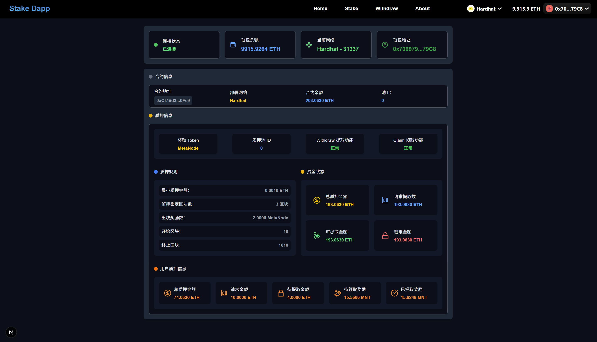
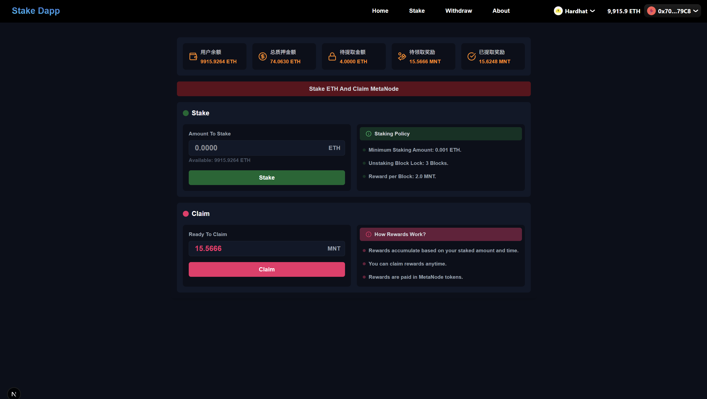
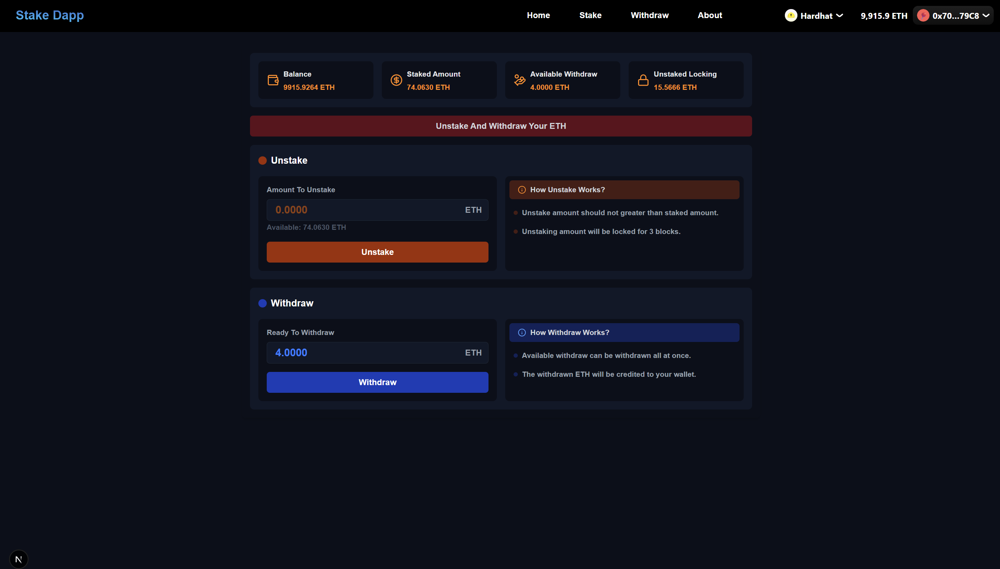

<!--
 * @Description: Stake项目
 * @Author: linxu devinlin9679@gmail.com
 * @Date: 2025-09-15 19:15:12
 * @LastEditors: linxu devinlin9679@gmail.com
 * @LastEditTime: 2025-09-29 17:18:35
-->
## 项目描述

### 1、项目介绍
这个是一个ETH和ERC20 Token质押生息的项目，包含：stake、unstake、withdraw、claim等操作。主要业务有：
- stake：质押ETH或ERC20 Token
- unstake：取消质押
- withdraw：提取质押的ETH或ERC20 Token
- claim：领取质押奖励

### 2、技术栈
- Next.js 15
- Wagmi
- Ethers.js V6
- RainbowKit
- Hardhat

### 3、业务需求
- ✅RainbowKit实现hardhat本地节点连接
- ✅使用RainbowKit实现钱包连接前后Header组件开发，展示钱包连接按钮，以及连接后的钱包信息展示
- ✅使用Wagmi查询链上数据
  - 获取hardhat链信息
  - 获取hardhat链上当前账户信息
- ✅使用Wagmi实现MetaNode合约读取信息
  - 获取MetaNodeToken的基本信息
  - 查询某个用户address的Balance
- ✅使用Wagmi实现MetaNodeStake合约读写操作
  - stake:  质押ETH或ERC20 Token
  - unstake: 取消质押(执行unstake操作后，需经过10个区块才能进入待提取金额中，才能withdraw)
  - withdraw: 提取质押的ETH或ERC20 Token
  - claim: 领取质押奖励
  - 读取Pool信息
  - 读取user的质押信息
- ✅使用Wagmi实现合约事件监听
  - 监听Stake事件
  - 监听Unstake事件
  - 监听Withdraw事件
  - 监听Claim事件

### 4、安装依赖
```bash
npm install @rainbow-me/rainbowkit wagmi viem@2.x @tanstack/react-query ethers
```

### 5、运行项目
```bash
npm run dev
```

### 6、系统截图
- Hmoe页面：查看Stake平台信息
 

- Stake页面：Stake and Claim操作页
 

- Withdraw页面：Unstake and Withdraw操作页


### 7、注意事项
- 当执行unstake操作后，需经过10个区块才能进入待提取金额中，才能withdraw
- 执行unstake操作后，执行withdrawAmount操作，可以发现`requestAmount`是unstake操作的所以请求解压金额
- `requestAmount`后，还有`pendingWithdrawAmount`，表示已经经过了unstake操作后10个区块，可以马上withdraw的金额
- `锁定金额`：表示已经unstake了，但是还未达到10个区块，计算公式：`LockAmount = requestAmount - pendingWithdrawAmount`